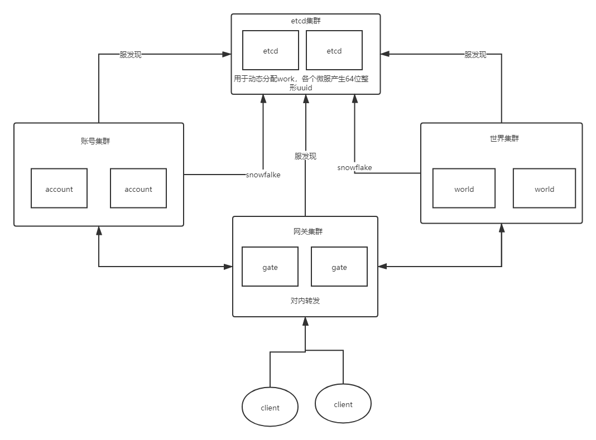
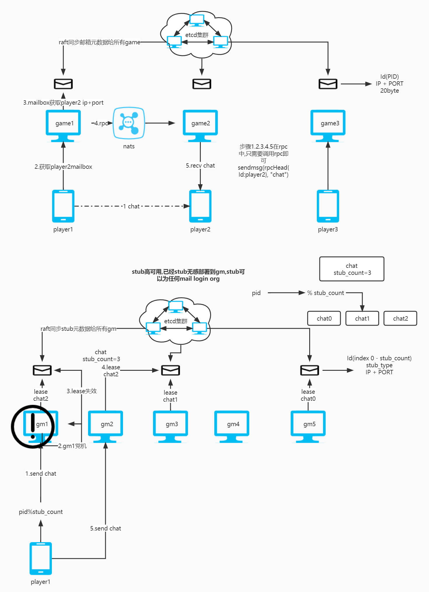

# go-server
gonet 游戏服务器架构。

框架优势
## actor
每个Actor都是一个独立的计算实体，Actor之间不共享数据，各个Actor只能操作自己的数据，所有的交互全部通过传递消息的方式进行，可以有效避免共享数据带来的并发竞争问题。

## virtual actor
降低分布式开发的复杂性，Actor总是存在，即不用关心代码在那个进程上运行，比如gm可以运行任一模块org,rank,activity具体模块actor怎么运行参考下面的stub。

## 玩家actor
每个玩家一个actor,解耦,模块耦合性弱,lease一致性保证分布式一致性问题

## orm
区别gorm,方便开发,玩家存储类似文档,玩家内存改变了定时同步给db,可以为各种嵌套结构

## 高可用
无单点服务,raft一致性同步元数组(mailbox(id->ip+port),stub),stub保证virtual actor高可用模式。
出故障影响部分玩家，高可用在lease内不可用。

## 分布式
参考下图的stub高可用(hash一致性)
以及player的mailbox(lease一致性)

## rpc
rpc模块脱离传统的注册-回调模式，只需要继承actor即可，actor的成员就是消息处理

## uuid
采用snowflake + etcd动态分配机器码

## 时间轮
    优势
    5级时间轮性能更佳O(1)
    对比timer
    go的定时器是大小堆,对高精度10毫秒定时器会吃掉大部分cpu
    
## 分布式消息队列
微服务，微服务之间使用分布式消息队列

## hotfix(进阶版)
不需要数据分离,应用更广泛的textcode jmp

## 属性同步(进阶版)
基于内存对比的属性同步,不需要写orm,a.b=1自动存盘,自动同步，对比代码自动生成,无需build

## rpc(进阶版)
类似脚本,自动生成代码,无需build

## mailbox
    actor之间消息队列采用mpsc的mailbox 
    优势
    actor适合mpsc的模式,消息队列满足邮件思想
    对比channel
    1.channel弊端在队列满了,投递消息会阻塞,假如actor处理过慢,大家都等着,谁也别想跑

    2.性能在多生产者消费者急剧下降(内部是锁)
    基准测试
    i7 10700 2.9GHZ 16核 执行10万次生产和消费         
    channel         
    BenchmarkChanPushPop/100000_1-16             252           4715405 ns/op
    BenchmarkChanPushPop/100000_2-16             174           6881893 ns/op
    BenchmarkChanPushPop/100000_4-16             180           6635532 ns/op
    BenchmarkChanPushPop/100000_8-16             142           8440178 ns/op
    BenchmarkChanPushPop/100000_16-16            129           9312717 ns/op            
    mailbox             
    BenchmarkPushPopActor/100000_1-16            252           4748732 ns/op
    BenchmarkPushPopActor/100000_2-16            205           5818782 ns/op
    BenchmarkPushPopActor/100000_4-16            278           4348560 ns/op
    BenchmarkPushPopActor/100000_8-16            297           3986121 ns/op
    BenchmarkPushPopActor/100000_16-16           304           3839012 ns/op

[WIKI](https://github.com/bobohume/gonet/wiki)

# 交流

QQ群:950288306

# 服务器架构如下：

# gm stub

